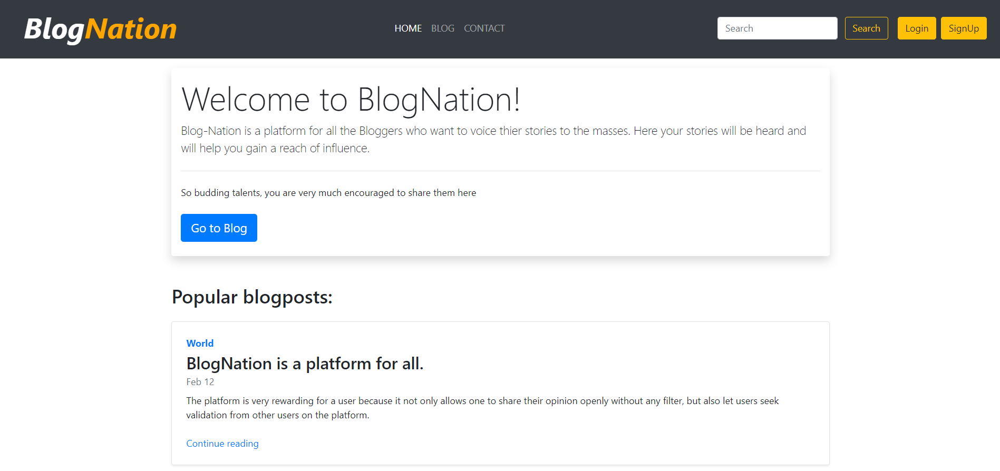

# BlogNation
A basic blogging web-app built using Django (Python), where users can login and share personal blogs on the platform.
Implemented Login system using Django-oauth.

 ## :large_orange_diamond: **Application Live Demo**  
 
  

 
